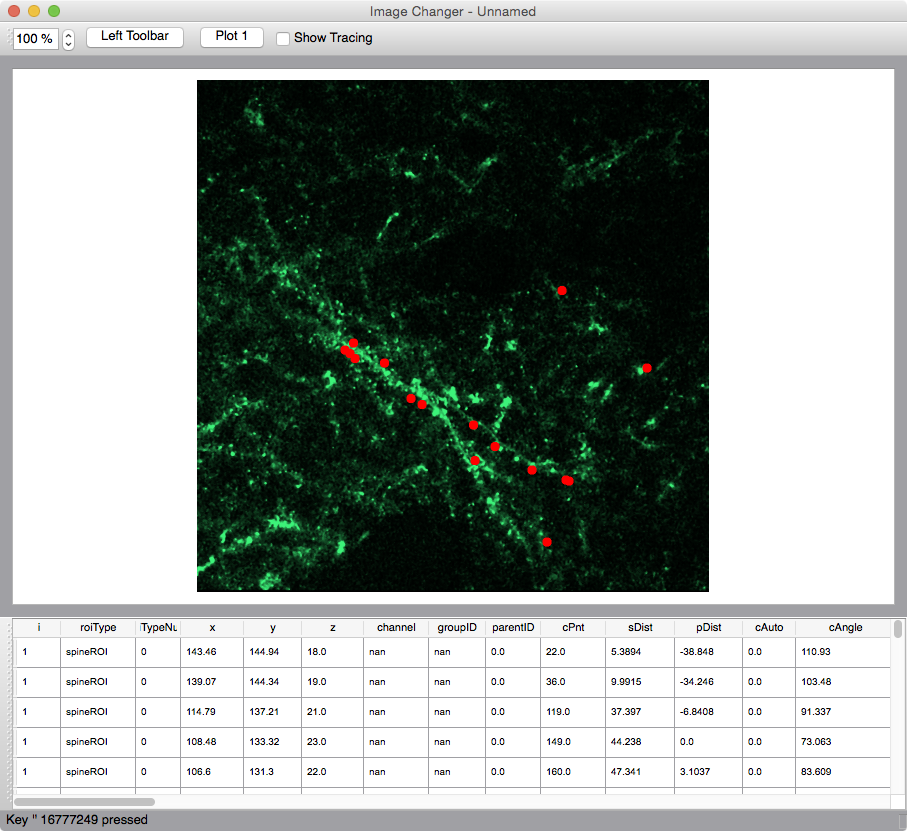
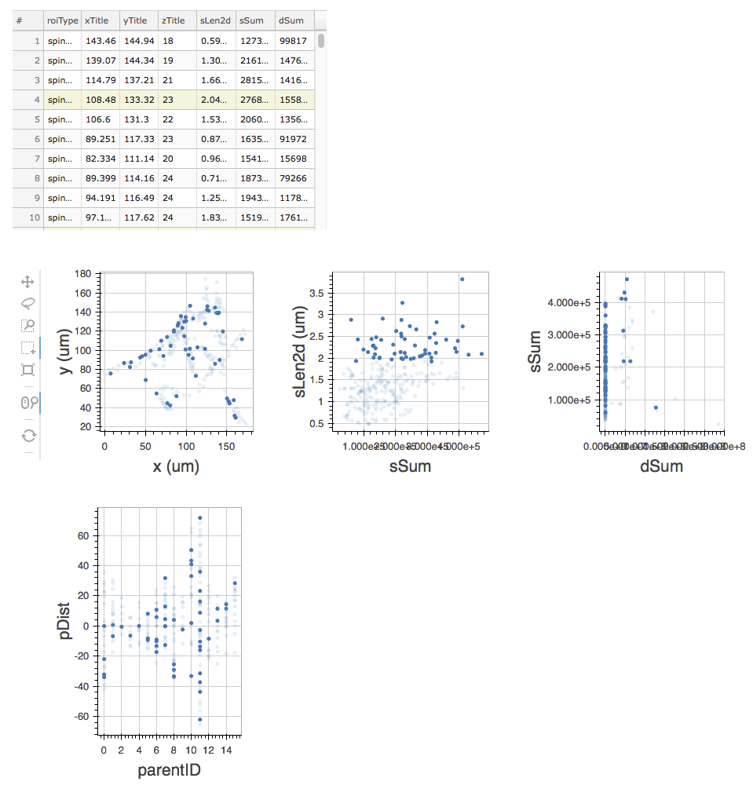

Repository providing python code to load, visualize, analyze, and plot [Map Manager][mapmanager] files. This can be done in three ways

 - Pure Python code using the bMapManager.py class library
 - Using the GUI of stackbrowser.py
 - Creating web based plots and analysis using bokeh.py

# Map Manager class library

See [bMapManager][bMapManager]. Include the following in a Python script...

	from bMapManager import bMap
	from bMapManager import bStack
	from bMapManager import bStackPlot

To run inside an ipython/jupiter notebook, also include

	%matplotlib inline
	from plotly.offline import init_notebook_mode
	init_notebook_mode() # run at the start of every ipython notebook to use plotly.offline

Requires numpy, pandas, tifffile

See [map.ipynb][1] for more sample code.

# Python based stack browser

A full GUI stack browser implemented in Python using [pyqt][pyqt]. Run the browser with...

    python stackbrowser2.py

The next image shows the stack browser interface. A single image plane of a 3D stack is displayed with an overlay of stack db points (red spines). The bottom table shows the stack db.

Eventual features are:

 - Load a single timepoint from Map Manager
 - 3D stack can be scrolled (image slices), panned, and zoomed
 - Image contrast can be adjusted
 - Display stack db points overload on image and as a table
 - Clicking a point in the image will select it in the table and visa-versa
 - Provide x/y plots. Clicking on a point in the plot will propogate to other views
 - Provide statistics (mean, standard error, and n) for any plot.
 

    
## Required libraries

    numpy
    pandas
    pyqt #see below
    tifffile #see below
    
### Install tifffile

    pip install tifffile

### Install pyQT on OSX

    brew install pyqt
    
### Installing additional image readers

The QT .jpg reader is not installed by default. Just use .png until this is figured out.

# Web browser plotting of Map Manager files using bokeh

Use the [bokeh][bokeh] python library to generates html pages with a table and x/y plots from a Map Manager file. Selecting points in one plot/table will propagate the selected points to other plots/tables.

	python bokeh1.py

Eventual features are:

 - Make a Flask app where a Map Manager map or single timepoint file can be loaded.
 - Interface to select x/y data from table and then make a new plot.
 - On selection, report mean/sd/se/n for selection in each plot
 - Provide more advanced plotting and statistics using pandas pivot tables. For example, plot all sLen2d and then create a visual mask and output statistics for each segment.

[mapmanager]: http://cudmore.github.io/mapmanager

[bokeh]: http://bokeh.pydata.org/en/latest/
[bMapManager]: https://github.com/cudmore/mapmanager_ipynb/blob/master/bMapManager.py
[pyqt]: https://riverbankcomputing.com/software/pyqt/intro
[1]: https://github.com/cudmore/mapmanager_ipynb/blob/master/map.ipynb